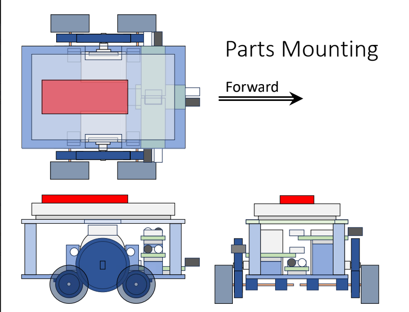
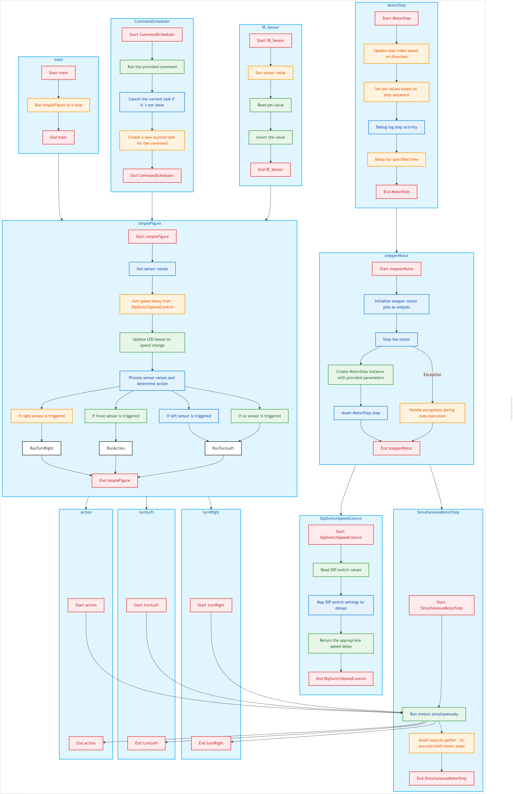

# MicroMouse - Project Write-Up

This project implements a stepper motor control system that autonomously adjusts motor speed and direction based on sensor feedback. It utilizes MicroPython and asynchronous programming with `uasyncio` to efficiently manage motor movements, sensor readings, and speed control, ensuring smooth operation without blocking.

### Table of Contents

1. [Introduction](#introduction)
2. [System Design](#system-design)
3. [Components](#components)
4. [Control Flow](#control-flow)
5. [Wiring and Setup](#wiring-and-setup)
6. [Future Enhancements](#future-enhancements)
7. [Images](#images)

---

## Introduction

The **Stepper Motor Control System** aka MicroMouse is designed to control a dual-stepper motor setup, reacting to obstacles detected by three infrared (IR) sensors. The system adjusts its movement based on sensor inputs to navigate autonomously, making decisions such as turning left, right, or moving forward. Additionally, the motor speed can be controlled via DIP switches, allowing for adjustable movement behavior.

This project is ideal for applications such as autonomous robots, movement-based sensing systems, or simple robot navigation tasks.

---

## System Design

The system comprises the following core components:

- **Stepper Motors**: These motors provide precise control over movement in steps. By changing the sequence of electrical pulses sent to the motor's coils, we control the direction and speed of the motor.
- **IR Sensors**: These sensors detect obstacles and provide input to guide the movement of the motors.
- **DIP Switches**: Control the speed of the motor by adjusting the delay between steps.
- **LED Indicator**: An LED is toggled to show changes in speed or status.

The overall architecture of the system follows a feedback loop:

1. Sensors provide real-time data on the environment.
2. The system determines actions (turn left, move forward, turn right) based on the sensor data.
3. The speed is adjusted based on the DIP switches, affecting the motor's delay and behavior.
4. Motors are controlled in a synchronized manner to ensure smooth movement.

---

## Components

### 1. **Stepper Motor Control**

The stepper motor is controlled via a sequence of steps that define its direction and movement. The system handles this in an asynchronous manner to avoid blocking and ensure smooth and continuous motor movement.

### 2. **IR Sensors**

Three IR sensors (left, front, and right) detect obstacles in the path of the robot. The input from these sensors is processed to determine the appropriate motor movement:

- If the **right sensor** detects an obstacle, the robot continues moving forward. This behavior ensures the robot is staying close to the right wall.
- If the **right sensor** is clear, the robot turns left to keep the right side against the wall.
- If the **front sensor** detects an obstacle, the robot turns right to avoid collisions.
- If the **left sensor** detects an obstacle, the robot turns right to stay close to the wall and avoid becoming stuck.
- If no sensors are triggered, the robot continues to follow the right wall, adjusting its movement to ensure it stays aligned with the wall.

### 3. **DIP Switch Speed Control**

Four DIP switches control the speed of the stepper motors by adjusting the delay between motor steps. The speed is adjusted dynamically based on the DIP switch state, allowing for a range of movement speeds from fast to slow.

---

## Control Flow

The core control flow of the system operates asynchronously to ensure the smooth execution of tasks. Below is a high-level description of how the system works, with a focus on the robot's right-wall-following behavior:

### Main Loop

- The `main` function initiates a loop where it continuously calls the `simpleFigure` function to assess the sensor values and control the motors accordingly.

### Sensor Value Processing (Right-Wall Following)

- The `simpleFigure` function retrieves the values from the IR sensors and adjusts the speed by calling the `DipSwitchSpeedControl` class.
- The system then processes the sensor values to implement the right-wall-following algorithm:
  - If the **right sensor** detects an obstacle (sensor value = 0), the robot continues moving forward. This behavior ensures the robot is staying close to the right wall.
  - If the **right sensor** is clear (sensor value = 1), the robot turns left to keep the right side against the wall.
  - If the **front sensor** detects an obstacle (sensor value = 0), the robot turns right to avoid collisions.
  - If the **left sensor** detects an obstacle (sensor value = 0), the robot turns right as well, to stay close to the wall and avoid becoming stuck.
  - If no sensor is triggered, the robot continues to follow the right wall, adjusting its movement to ensure it stays aligned with the wall.

### Speed Control

- The speed control is dynamically updated whenever there is a change in the DIP switch setting, and the LED is toggled to indicate the new speed.

### Motor Movement

- The `SimultaneousMotorStep` class allows for synchronized control of both the left and right motors. Both motors are adjusted simultaneously to ensure smooth and coordinated movement as the robot follows the right wall.

---

## Wiring and Setup

### Stepper Motors

The stepper motors are connected to the GPIO pins of a microcontroller, with the wiring based on the specific hardware being used. Ensure that the motor drivers are correctly connected to the stepper motor.

### IR Sensors

The three IR sensors are connected to the microcontroller’s GPIO pins to detect obstacles. Each sensor provides a digital output based on the presence or absence of an obstacle.

### DIP Switches

The DIP switches are connected to the GPIO pins to adjust the motor’s speed dynamically. The switches' positions are read by the `DipSwitchSpeedControl` class to map them to a speed value.

### LED Indicator

The LED is connected to an output pin and toggled whenever the speed changes. This provides visual feedback to the user regarding the current speed setting.

---

## Future Enhancements

- **Obstacle Avoidance**: Enhance the sensor logic to include more advanced obstacle avoidance algorithms, allowing the system to automatically navigate around objects in a more intelligent manner.
- **Wireless Control**: Integrate wireless communication (such as Bluetooth or Wi-Fi) to control the motors remotely.
- **Sensor Array Expansion**: Add more sensors (e.g., ultrasonic) to provide a wider range of obstacle detection and improve navigation accuracy.
- **Autonomous Pathfinding**: Implement more advanced algorithms for pathfinding, allowing the robot to follow a predetermined path or navigate through complex environments.

---

## Images

### Parts Mounting

This image shows the layout and mounting of the system's key components, including the motors and sensors.

### Project Flow Diagram

This flow diagram illustrates the system's control flow, from sensor input to motor control, and how different components interact within the system.

---

This write-up outlines the key design and functionality of the stepper motor control system. The system effectively integrates motor control, sensor input, and speed control into an efficient, non-blocking system that can be easily adapted or expanded for various robotic applications.
